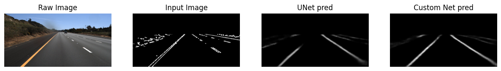

## Lane Detection using attention.

* This repository contains the notebook `lane_detector.ipynb` that analyses two models - the UNet and a custom UNet. The Custom Unet utilizes residual blocks and attention to focus on more important features of the image.

* I have used the [TUSimple dataset](https://github.com/TuSimple/tusimple-benchmark/tree/master/doc/lane_detection). You can get it [here](https://www.kaggle.com/datasets/manideep1108/tusimple).

* you can access the Unet model and the custom UNet model [here](https://drive.google.com/file/d/1XCYvkpXMAJv_PsZzAiRw6lUKici_KkGE/view?usp=sharing). Feel free to try them out

* you can access the output videos [here](https://drive.google.com/file/d/1Vjg4G92qZaNwPObSyxzSXnLtLEDfqt3j/view?usp=sharing)

* You can view a detailed explanation of my algorithm on [medium](https://medium.com/@pranav.agarw/lane-detection-for-autonomous-driving-using-attention-5f2798c4ab61).

